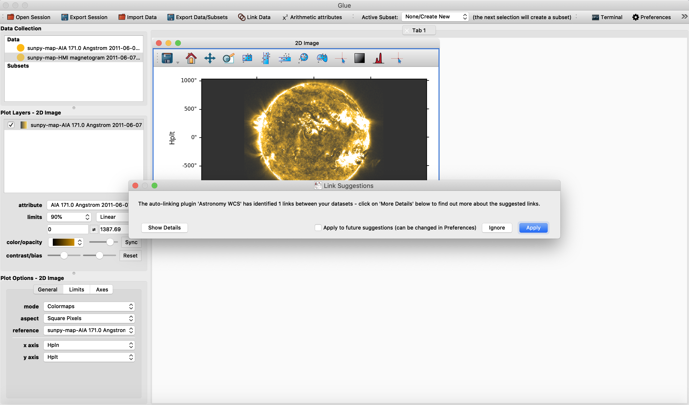
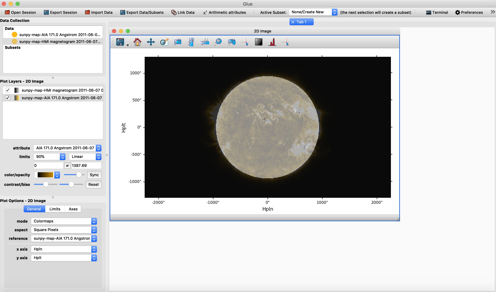

.. _loading_aia_and_hmi_files:

========================================================
Loading and Overplotting AIA and HMI files as SunPy Maps
========================================================

Loading an AIA file
-------------------
To load an AIA file as a SunPy Map with the ``glue-solar`` plugin of ``glue`` is
very straightforward. Upon firing up ``glue`` while the environment is with
``glue-solar`` installed, simply import data with the third icon from the left on the top
navigation bar of ``glue``, choose the file one would like to view, then before clicking
the "Open" button on the lower right corner of the loader select from the dropdown menu
at the bottom the "SunPy Map" format. Otherwise the AIA file would be loaded automatically
as an ordinary FITS file instead. The colormap used in ``glue`` for this AIA file would
then be one for the AIA format, depending on the wavelength.

Loading a corresponding HMI file
--------------------------------
The procedure is similar, except that the default colormap for each of the HMI files
is different. Autolinking in the spatial dimensions is automatically detected,
but the actual autolinking is performed only after this option is selected/agreed
to by the user.

Overplotting AIA and HMI SunPy Maps as Colormaps
------------------------------------------------
Once both the AIA and corresponding HMI data have been loaded, first drag and drop
the AIA dataset from the upper left "Data Collection" panel to the viewing area
with the "2D Image" data viewer chosen to display the AIA image. The result would be
a view like the following:

.. image:: images/loading-aia-and-hmi-1.png
   :width: 800
   :alt: Viewing AIA SunPy map individually

Autolinking is automatically detected. If this is say your first time, you would be prompted
with a dialog box to autolink as below:

If dragging the HMI dataset to a space outside of the AIA SunPy map now, you would see:

.. image:: images/loading-aia-and-hmi-3.png
   :width: 800
   :alt: Viewing HMI SunPy map individually along AIA one

On the other hand, if dragging and dropping the HMI data set on top of the AIA image
to overplot as different colormaps, we would expect to see the following:

The final result should be an overplot of both the AIA and HMI SunPy maps as
different colormaps. Note that the ``limits`` such as scale has been tweaked
to bring out the more salient feaures in the 2D image views.
