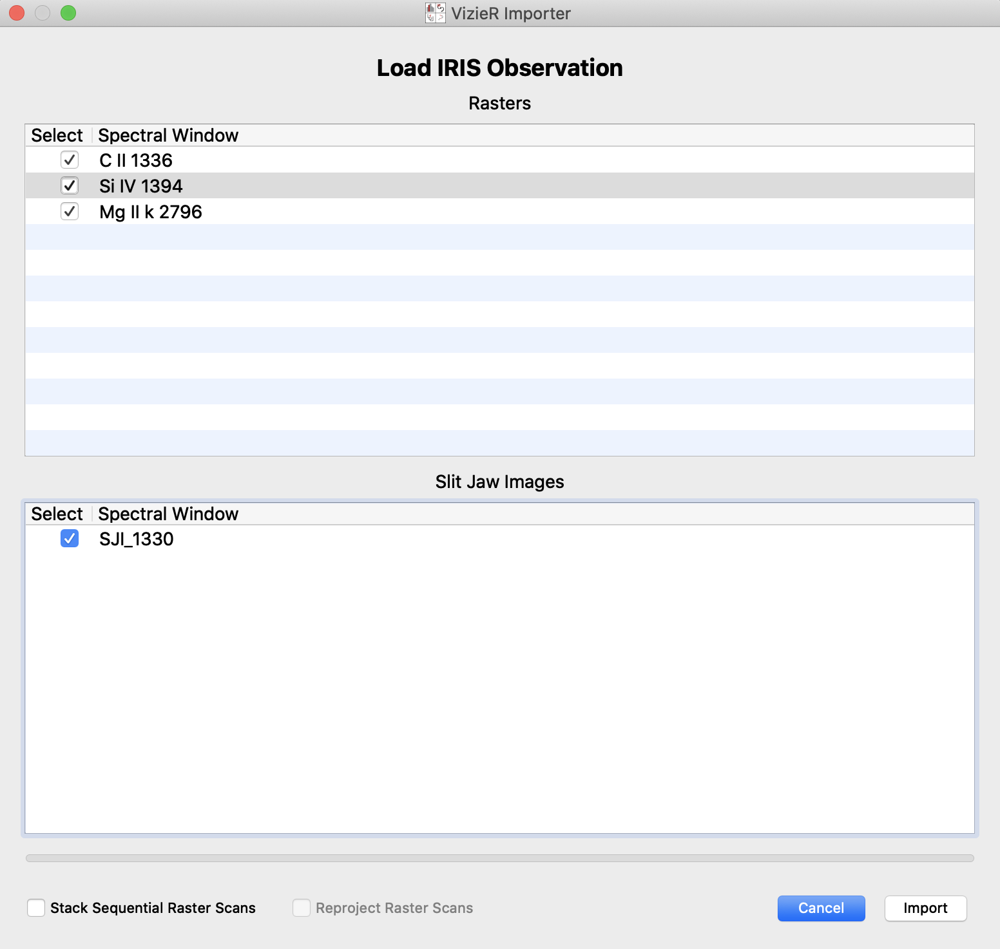

.. _loading_iris_level_2_raster_and_sji_files:

=======================================================
Loading IRIS Level 2 Raster and SJI Data Files Together
=======================================================

Using the custom IRIS importer
------------------------------
Using the custom IRIS ``glue`` data importer, one can handle the loading of different raster
and SJI files of IRIS Level 2 data for the same observation with ease. To begin, point the
cursor to the "File" dropdown menu and the choose "Import Data", and after which choose the
"Import IRIS OBS Directory" option. Like in the image below:

.. image:: images/loading-iris-data-1.png
   :width: 800
   :alt: The "Import IRIS OBS Directory" option in ``glue``

Take care to make sure all the IRIS data files for the same
observations you would like to investigate with ``glue`` are all located in the same directory.
Then, a popup dialog box would allow you to choose the desired observation directory containing
the "raster" and "SJI" files of interest. Upon clicking "Open" on the lower right of the dialog
box, a VizieR importer would pop up with the heading "Load IRIS Observation", with the available
data sets listed in the respective "raster" and "SJI" fields, as shown in the image that follows:

After successfully loading the chosen data files, if autolinking if available, you will be prompted
to link up the files concerned. A dialog box like what follows would pop up:

.. image:: images/loading-iris-data-3.png
   :width: 800
   :alt: Autolinking option for the IRIS OBS importer

Finally, you are all set to examine the IRIS Level 2 data using ``glue`` with the ``glue-solar``
plugin. Voila!