.. _guide_to_1dprofile_viewer_for_iris_data:

=============================================================================
A guide to using ``glue``'s 1D profile viewer to probe IRIS Level 2 data sets
=============================================================================

Loading multi-scan IRIS Level 2 data sets and stacking the sequential raster cubes
----------------------------------------------------------------------------------

It is important to note that it would be preferable to use the directory loader as opposed to the file loader for this task.
To do this, we will first need to load some multi-scan IRIS Level 2 data sets collected from the same observation (i.e. having identical ``OBSID``) with the "Import IRIS OBS Directory" option under "File"'s "Import data":

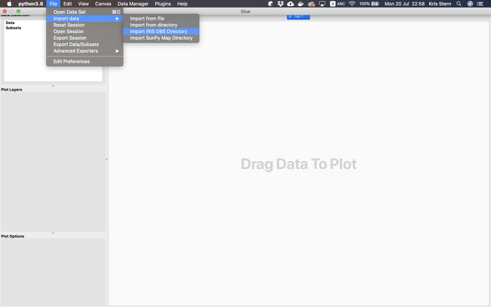

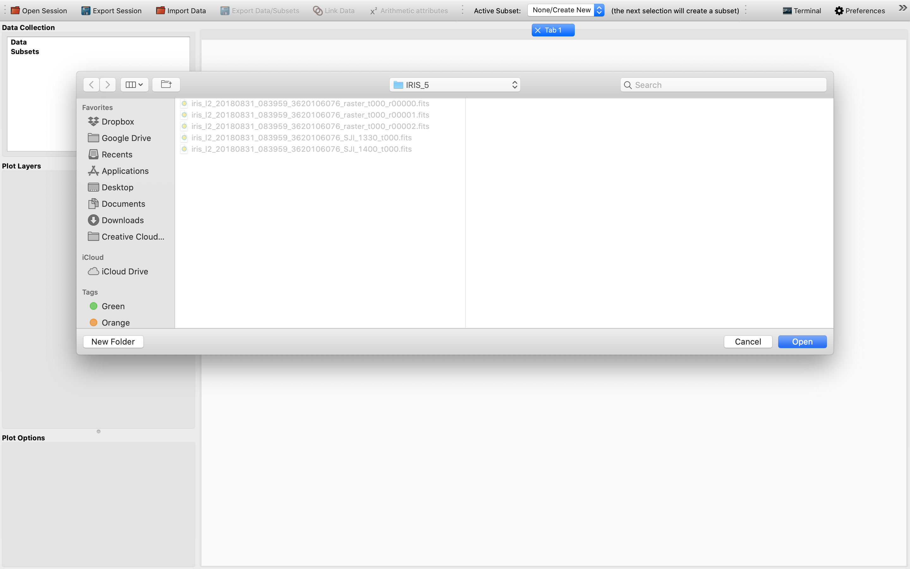

Then, choose the relevant raster and SJI data cubes of different scans and remember to stack the sequential raster cubes in order to obtain 4D data cubes from 3D ones.
An example view of this step:

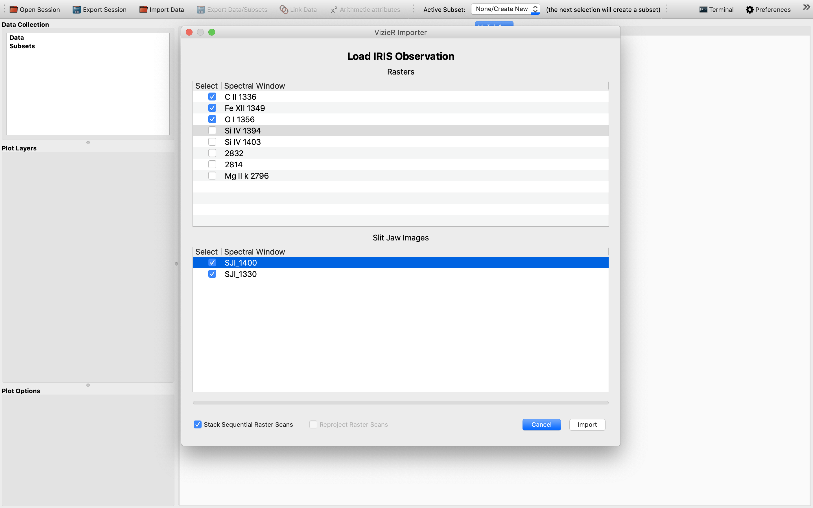

We have chosen 3 raster and 2 SJI data sets to import as an example to illustrate this functionality.
Once the IRIS data sets have been successfully loaded, we will see the data sets showing up in the "Data Collection" window in the upper left of the GUI:

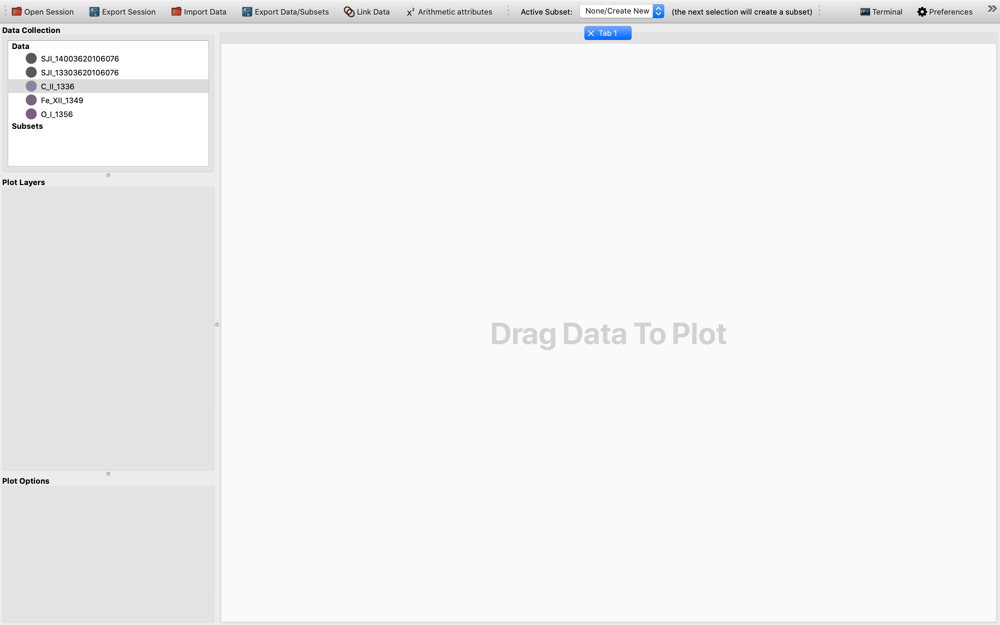

Now we are ready to visualize the 2D slices of the imported data cubes.

Using ``glue``'s 2D image viewer to get the indices and slices needed for the 1D spectrum plot
----------------------------------------------------------------------------------------------

To plot 2D slices of the ND data cubes, we will need to drag the data ("C_II_1336" in this
example) concerned from the "Data Collection" area and drop it at the large plotting window
to the right, as shown in the following image:

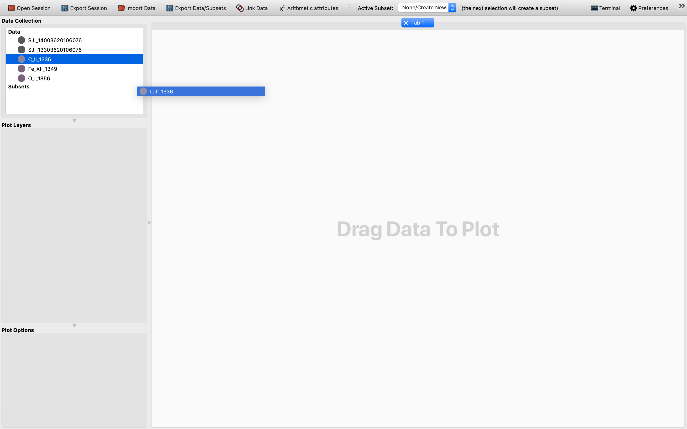

Once the data is dropped, a dialog box will pop up and prompt the user to select which viewer
to use for the data visualization. In this case, we will need to choose the 2D Image viewer,
as follows:

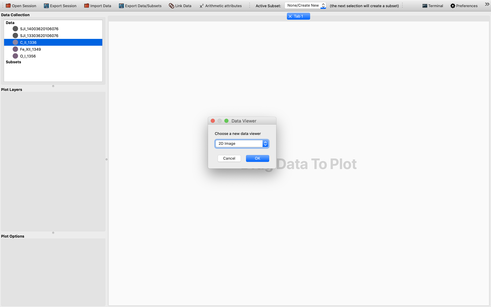

Afterwards, we will be presented with a 2D slice of the chosen 4D (sequentially stacked)
data cube in the plotting window. It might not be a bad practice to switch to a more
nuanced color scheme and to change the limits to for example "99%" as demonstrated
in this example. This way the cube is easier to see and is more colorful:

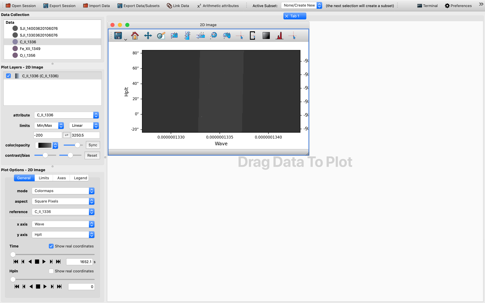

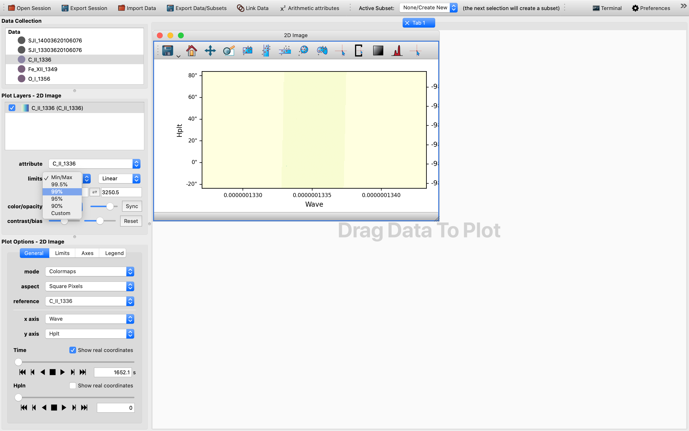

For now the default x-axis has been set to be that of the wavelength. To turn the 2D slice
into a map with celestial axes, we change the x-axis into ``HPLN`` (i.e., the longitude),
while keeping the y-axis as ``HPLT`` (i.e., the latitude). This way the sliders are
now ``TIME`` and ``WAVE``, respectively. For the data cube we have used once this change
is effected the 2D cube should be blank. In order to get a glimpse of the data cube,
we will need to tweak the wavelength slider until we can see a slice with a different shade
of color. Once this is achieved, we can then select any pixel in this area with
the pixel extraction tool. To use the pixel extraction tool, firstly activate
its icon on top of the 2D image viewer. Then, as the instruction provided, click to select a
point of interest. In this case in principle any point in the rectangular area of a darker shade
of color would be a suitable choice, as the images below shows:

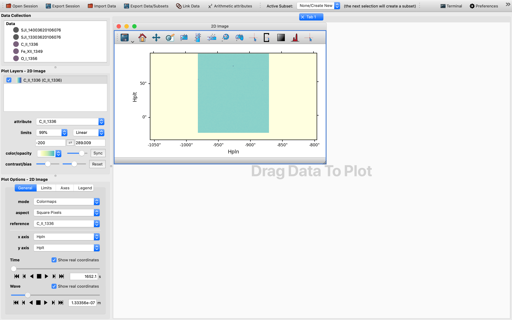

Now it is probably time to check that we have both an ``IndexedData`` object and a
``SlicedData`` object in the Data Collection section. The former is represented by a Python list,
whereas the latter is represented by a Python tuple. Once this is checked we are all set to
move on to the next stage, see below:

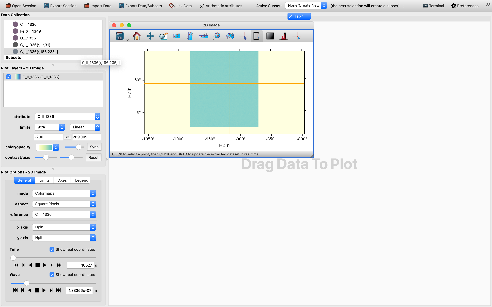

Using Glue's 1D Profile viewer to generate 1D spectra at different spatial and temporal positions
-------------------------------------------------------------------------------------------------
Like for the 2D slices case, we will need to drag and drop the same data set onto the plotting
window in order to start the 1D Profile viewer, with the ultimate goal to generate non-collapsed
1D spectra that change with changes in the slider values. Please keep in mind to select the exact
same data and not either of the ``IndexedData`` object or the ``SlicedData`` object that shares
a very similar representation, otherwise an error would be thrown:

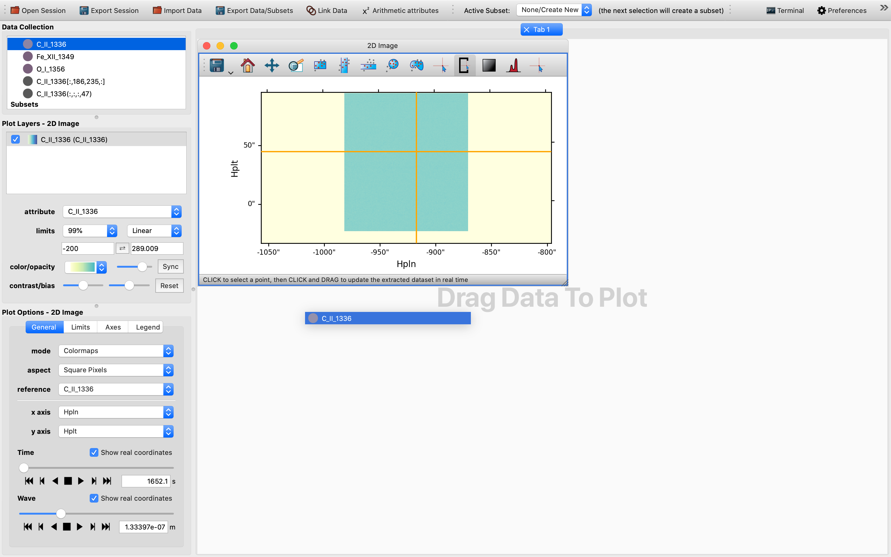

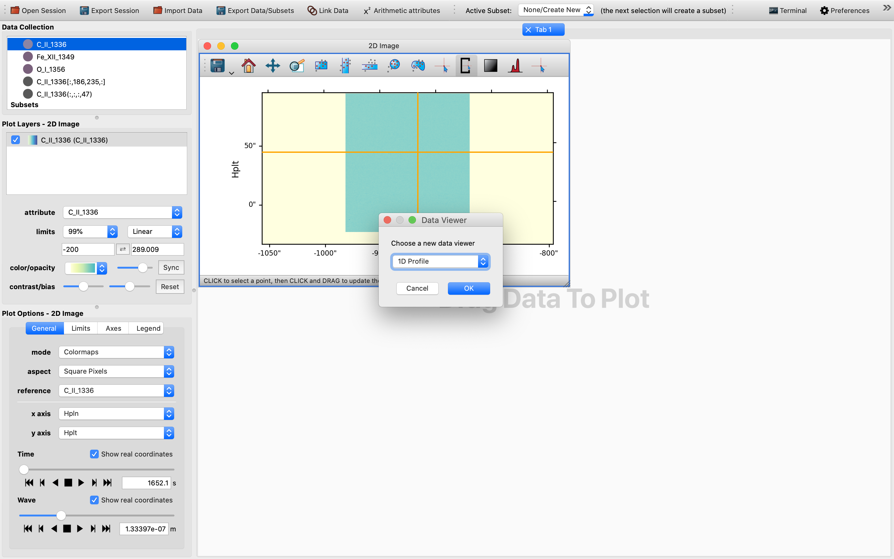

Once the 1D Profile viewer shows up, you will be shown a collapsible version of the ``Maximum``
function of the 1D spectrum. However, this may not be very telling and is not a genuine 1D
spectrum, but is a statistical representation of the maximum of the quantity concerned.
By default the x-axis for the setup is ``TIME``, so we will need to first tweak the time slider
in order to trigger the generation of a ``SlicedData`` object with a non-trivial slice value
for the time dimension, as time in this context is effectively the variable. So one would expect to
see up to two ``SlicedData`` objects appearing simultaneously in the Date Collection window:

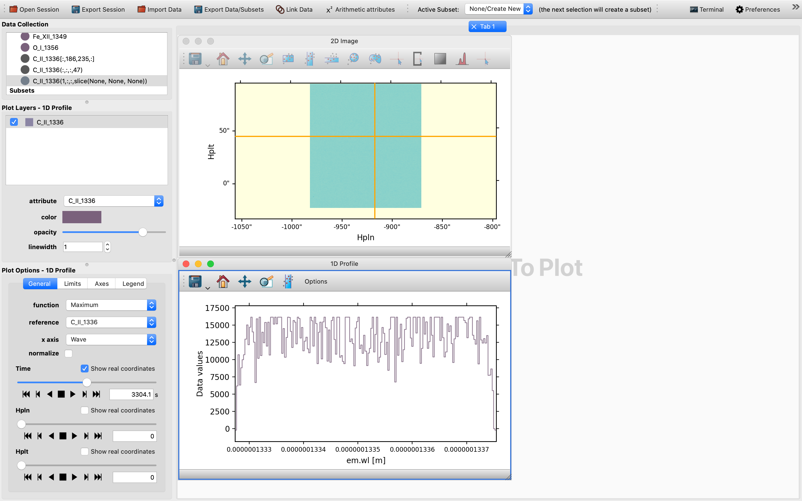

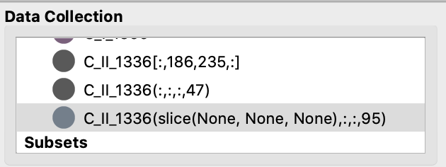

Then, switch from the default "Maximum" function to the "Slice" function in order to obtain
an un-collapsed version of the 1D spectrum, which can be controlled by the sliders for the
1D Profile viewer in the Options Widgets window in the lower left corner. Voila, the final
result would be one such as the following:

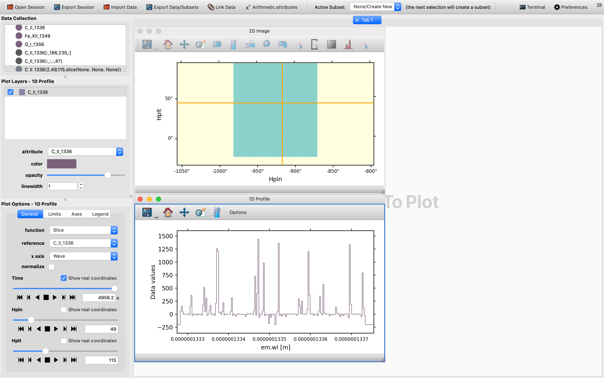
