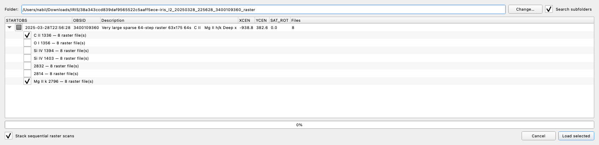
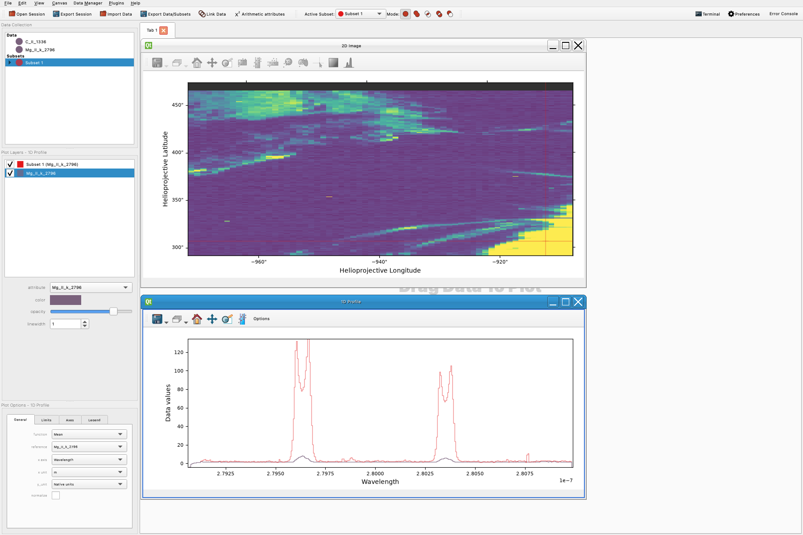

.. _glue_solar_user_guide_1dprofile_viewer_for_iris_data:

=============================================================================
A guide to using ``glue``'s 1D profile viewer to probe IRIS Level 2 data sets
=============================================================================

Loading and stacking multi-scan IRIS Level 2 raster cubes
---------------------------------------------------------

Use the observation browser for this task because it groups raster scans by observing-program
execution and lets you select spectral windows before loading their arrays. Open
"Plugins -> IRIS: browse observations..." and point it at a directory containing the IRIS
Level 2 files or their downloaded archives. If an archive is still packed, tick its
"Extract ..." entry and press "Load selected" first; the browser refreshes and shows its contents.
Then tick the raster spectral windows to load (``C II 1336`` and ``Mg II k 2796`` here) and tick
"Stack sequential raster scans" to place two or more scans of each selected window into one 4D
cube without resampling their detector values. A window with only one scan loads as its normal 3D
dataset.

The browser uses ``irispy`` to read the selected files and returns the datasets to Glue.
Once loaded, the data sets show up in the "Data Collection" window in the upper left of the GUI.
A stacked window is labelled ``<window>-<OBSID>-<STARTOBS>-stack``, while unstacked scans are
labelled ``<window>-<OBSID>-<STARTOBS>-scan-<n>``. Including ``STARTOBS`` keeps repeated executions
of the same observing program distinct.

The stacked cube has a leading ``Scan`` coordinate rather than pretending that a complete raster
was acquired at one instant. Its separate ``Time`` component records the exact acquisition time
of every pixel. Scan 0 supplies the nominal helioprojective WCS for the whole stack; subsequent
scans keep their original raster and detector indices, not their distinct absolute pointings.
Load the original per-scan datasets when those per-scan absolute coordinates are required.

Using ``glue``'s 2D image viewer to pick a pixel
------------------------------------------------

Drag the stacked ``Mg_II_k_2796`` dataset from the "Data Collection" area onto the large plotting
window to the right and choose "2D Image". The viewer shows one slice of the 4D
(scan, raster position, slit position, wavelength) cube. By default the x-axis is ``Wavelength``
and the y-axis is ``Helioprojective Latitude``, so you are looking at the spectrum along the slit,
with sliders for ``Scan`` and ``Helioprojective Longitude``.

The raw min/max limits can make the slice look flat. Change the limits to "99%" and pick a more
nuanced colormap so the emission lines stand out.

To turn the slice into a map with celestial axes, change the x-axis to
``Helioprojective Longitude`` while keeping the y-axis as ``Helioprojective Latitude``.
The sliders are then ``Scan`` and ``Wavelength``. Set the aspect to "Automatic" so the narrow
raster field fills the plot, then move the ``Wavelength`` slider onto the line core until
structure appears in the map.

Now activate the pixel selection tool (the crosshair icon in the viewer toolbar) and click a
point of interest. This creates a subset, ``Subset 1``, containing that pixel in every scan and
wavelength; it appears under "Subsets" in the Data Collection and is drawn on top of the image.
Click and drag to move it interactively.

Using Glue's 1D Profile viewer to plot the spectrum and scan evolution
----------------------------------------------------------------------

Drag ``Mg_II_k_2796`` onto the plotting window again and choose "1D Profile". The profile viewer
collapses the cube over every axis except the one chosen as the x-axis; pick ``Wavelength`` as
the x-axis and "Mean" as the function. The ``Mg_II_k_2796`` layer is then the mean spectrum of the
whole cube and the ``Subset 1`` layer is the spectrum at the selected pixel, averaged over the
stacked scans.

Switching the x-axis to ``Scan`` gives the intensity evolution by raster number, averaged over the
spectral window. The ``Time`` component supplies the exact acquisition timestamp for individual
pixels, but it depends on both scan number and raster position and is therefore not a single Glue
profile axis. Both profiles update as you move the pixel selection in the image viewer.
