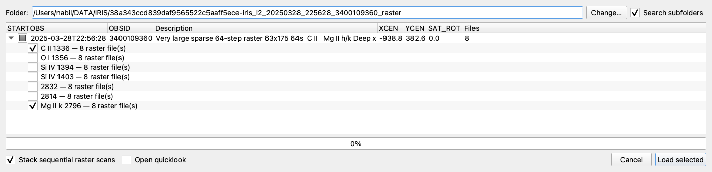
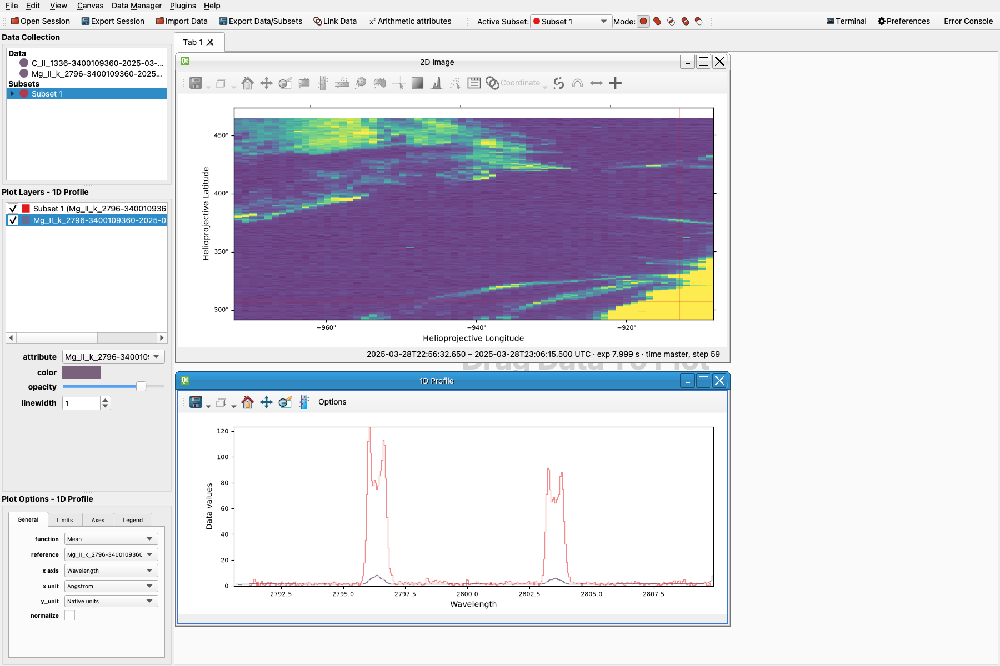

.. _glue_solar_user_guide_1dprofile_viewer_for_iris_data:

=============================================================================
A guide to using ``glue``'s 1D profile viewer to probe IRIS Level 2 data sets
=============================================================================

Loading and stacking multi-scan IRIS Level 2 raster cubes
---------------------------------------------------------

Use the observation browser for this task because it groups raster scans by observing-program
execution and lets you select spectral windows before loading their arrays. Open
"Plugins -> IRIS: browse observations…" and point it at a directory containing the IRIS
Level 2 files or their downloaded archives. If an archive is still packed, tick its
"Extract ..." entry and press "Load selected" first; the browser refreshes and shows its contents.
Then tick the raster spectral windows to load (``C II 1336`` and ``Mg II k 2796`` here) and tick
"Stack sequential raster scans" to place two or more scans of each selected window into one 4D
cube without resampling their detector values. A window with only one scan loads as its normal 3D
dataset.

The browser uses ``irispy`` to read the selected files and returns the datasets to Glue.
Once loaded, the data sets show up in the "Data Collection" window in the upper left of the GUI.
A stacked window is labelled ``<window>-<OBSID>-<STARTOBS>-stack``, while unstacked scans are
labelled ``<window>-<OBSID>-<STARTOBS>-scan-<n>``. Including ``STARTOBS`` keeps repeated executions
of the same observing program distinct.

The stacked cube has a leading ``Scan`` coordinate rather than pretending that a complete raster
was acquired at one instant. Its separate ``Time`` component records the exact acquisition time
of every pixel. Each scan keeps its original raster and detector indices and its own absolute
pointing: a pixel's helioprojective coordinates are those of its scan.

Using ``glue``'s 2D image viewer to pick a pixel
------------------------------------------------

Drag the stacked ``Mg_II_k_2796`` dataset from the "Data Collection" area onto the large plotting
window to the right and choose "2D Image". The viewer shows one slice of the 4D cube, whose axes
Glue lists as ``Scan``, ``Helioprojective Longitude`` (raster position),
``Helioprojective Latitude`` (slit position) and ``Wavelength``. By default the x-axis is
``Wavelength`` and the y-axis is ``Helioprojective Latitude``, so you are looking at the spectrum
along the slit, with sliders for ``Scan`` and ``Helioprojective Longitude``.

The raw min/max limits can make the slice look flat. Change the limits to "99%" and pick a more
nuanced colormap so the emission lines stand out.

To turn the slice into a map with celestial axes, change the x-axis to
``Helioprojective Longitude`` while keeping the y-axis as ``Helioprojective Latitude``.
The sliders are then ``Scan`` and ``Wavelength``. Set the aspect to "Automatic" so the narrow
raster field fills the plot, or choose "Physical aspect" in the toolbar's View menu to see it in its
proportions on the sky, then move the ``Wavelength`` slider onto the line core until structure
appears in the map.

Now activate the "Pixel" tool in the viewer toolbar ("Select a single pixel based on mouse
location") and click a point of interest. This creates a subset, ``Subset 1``, containing that
pixel at every wavelength in the scan shown by the ``Scan`` slider; it appears under "Subsets" in
the Data Collection and is drawn on top of the image.
Click and drag to move it interactively.

Using Glue's 1D Profile viewer to plot the spectrum and scan evolution
----------------------------------------------------------------------

Drag ``Mg_II_k_2796`` onto the plotting window again and choose "1D Profile". The profile viewer
collapses the cube over every axis except the one chosen as the x-axis, using its function, which
starts as "Maximum". Pick ``Wavelength`` as the x-axis and "Mean" as the function. The
``Mg_II_k_2796`` layer is then the mean spectrum of the whole cube, the equivalent of CRISPEX's
average spectrum. The ``Subset 1`` layer is the spectrum at the selected pixel in the scan it was
selected in: the subset holds one sample per wavelength, so Mean returns that sample unchanged.

The values are floating point, with NaN in place of the -200 and -199 fill of the files. The profile
functions skip NaN samples, so the fill is left out.

No glue release has a profile function that plots the profile through one position without
collapsing, so use a one-pixel subset with Mean as above.

Switching the x-axis to ``Scan`` makes the ``Mg_II_k_2796`` layer the mean intensity of each scan,
by raster number; the ``Subset 1`` layer then has only the scan it was selected in. The ``Time``
component supplies the exact acquisition timestamp for individual pixels, but it depends on both
scan number and raster position and is therefore not a single Glue profile axis. The ``Subset 1``
profile updates as you move the pixel selection in the image viewer.

Comparing a spectrum with the mean spectrum
-------------------------------------------

Select the raster window or stack in the "Data Collection" and choose "IRIS: subtract mean
spectrum" from its right-click menu. It adds two attributes to the dataset:

- ``<label> mean spectrum``, the mean of its values at each wavelength over every raster step or
  exposure, slit position and, for a stack, every scan, with the -200 and -199 fill left out (NaN
  at a wavelength where every sample is fill);
- ``<label> minus mean spectrum``, its values less the mean spectrum, in their unit.

In the 1D Profile viewer, select the ``Subset 1`` layer in the viewer's layer list and set its
"attribute" to ``<label> minus mean spectrum``: the profile is then the selected pixel's spectrum
less the mean spectrum, and follows the pixel as you move it. As an Image viewer's attribute, it
maps where each wavelength is brighter or fainter than the mean.

The mean spectrum is computed once, a few raster steps at a time, and held as one spectrum; glue
computes the difference only where it is shown. Glue's arithmetic attribute editor makes other
comparisons from the two attributes, such as the values over the mean spectrum. A dataset that has
them already, or other data than a raster window or stack, is refused. In glue's terminal,
``glue_solar.sources.moments.subtract_mean_spectrum(data)`` adds them and returns the difference's
attribute.

Recipes
-------

:ref:`The quicklook <glue_solar_users_guide_iris_quicklook>`
sets up most of these views. The recipes below build them by hand with glue's own viewers, for any
raster. Glue names a raster's axes after its world coordinates, so by role they are:

.. list-table::
   :header-rows: 1

   * - Role
     - Glue's name for the axis
   * - Raster step
     - ``Helioprojective Longitude``
   * - Exposure of a sit-and-stare raster, in acquisition order
     - ``Helioprojective Longitude``
   * - Position along the slit
     - ``Helioprojective Latitude``
   * - Wavelength
     - ``Wavelength``
   * - Scan of a stack
     - ``Scan``
   * - Slit-jaw frame
     - ``Time (Utc)``

The ``Time`` component gives the time of each raster step or exposure.

**Views.** Drag the raster onto the canvas, choose "2D Image" and set the "x axis" and "y axis" in
the viewer's options:

- spectrogram: wavelength against slit (x ``Wavelength``, y ``Helioprojective Latitude``), glue's
  default for a raster, with a slider for the raster step or exposure;
- raster map: step against slit (x ``Helioprojective Longitude``, y ``Helioprojective Latitude``),
  with a ``Wavelength`` slider;
- time–wavelength: wavelength against exposure (x ``Wavelength``, y ``Helioprojective Longitude``)
  for a sit-and-stare raster, or against scan (y ``Scan``) for a stack. On a scanning raster the
  same axes give wavelength against raster step.

**Four panels.** Open a raster map, a spectrogram, a slit-jaw image and a 1D Profile of the raster
with ``Wavelength`` as its x axis, then choose "Canvas -> Gather Windows" (Ctrl+G) to place them side
by side. The 1D Profile viewer asks "Add large data set?" for datasets of 1e8 samples or more, with
Cancel as the default button.

**Pixel.** "Pixel" in an Image viewer of a raster selects a detector pixel, one step (and scan) and
slit position at every wavelength, and the Profile shows its spectrum. Click to select, or drag to
move the point; it stays where you release the button. Pixel replaces the selected subset and
switches glue's selection mode to replace.

**Navigate.** "Options" in the Profile viewer's toolbar opens glue's
`profile tools <http://docs.glueviz.org/en/stable/gui_guide/spectrum.html>`__. On their "Navigate"
tab, click the profile or drag its line to move the wavelength slider of every Image viewer of the
same raster to the nearest wavelength.

**Band maps.** On the "Collapse" tab, drag a wavelength range on the profile, pick a function (Mean,
Median, Minimum, Maximum, Sum, Moment 1 or Moment 2) and press "Collapse": the Image viewers of the
raster show the data combined over the range, each until you move any of its sliders. glue-qt 0.4.2
leaves out the sample at the upper end of the range, so the range must cover at least two samples.
For a mean over a band that follows the wavelength slider, use "Wavelength band…" in the Image
viewer's View menu (see :ref:`glue_solar_users_guide_viewer_tools_and_windows`).

In glue-qt 0.4.2, Navigate and Collapse pick the wrong wavelengths when the Profile's "x unit" is not
the data's own (``Angstrom`` for IRIS wavelengths), so leave it unchanged for them.

**Rest wavelength from a measured line.** Level 2 wavelengths can be off by about 5-10 km/s, and
the FUV and NUV detectors drift apart. O I 1355.5977 Å, in a window covering it such as ``O I 1356``,
forms low enough to be nearly at rest and measures the offset of the FUV windows (C II, Si IV, O I);
Ni I 2799.474 Å, an absorption line in the ``Mg II k 2796`` window, measures the NUV's (Mg II). With
``Wavelength`` as the Profile's x axis and "Mean" as its function, for the signal of the whole
raster, pick "Gaussian + constant (IRIS)" on the "Fit" tab, drag a range over the line, about
1355.4 to 1355.8 Å for O I or 2799.3 to 2799.65 Å for Ni I, and press "Fit". It fits astropy's
``Gaussian1D`` on a ``Const1D`` to the samples in the range, the NaN fill left out, from the
constant at their median and the line at the sample farthest from it, so an absorption line fits
too. The report lists ``amplitude_0``, the constant, and ``amplitude_1``, ``mean_1`` and
``stddev_1``, the Gaussian's, then the centre and, within 0.5 Å of a main IRIS line with the x unit
``Angstrom``, its velocity from that line, (centre / rest - 1) c; Ni I is not one. Add the offset,
the centre minus the measured line's rest wavelength, to the rest wavelength of a line on the same
detector and set that with "Set rest wavelength…" on its window, so both the
:ref:`line moments <glue_solar_users_guide_iris_line_moments>` and red-blue asymmetry start from it
(see :ref:`Rest wavelength <glue_solar_users_guide_iris_rest_wavelength>`), or type it as the line
moments' centre: on OBSID 3824262996, whose mean O I fits at 1355.6172 Å, +4.30 km/s, Si IV 1402.77 Å becomes
1402.789 Å, and Ni I fits at 2799.4729 Å, -0.12 km/s. The offset changes over the orbit; irispy's
``irispy.utils.wavelength_drift.calculate_wavelength_drift``, on the raster read with
``irispy.io.read_files`` in glue's terminal, fits O I and Ni I 2799.474 Å along the slit in every
exposure.

**Slice Extraction.** In an Image viewer of a raster or slit-jaw cube, "Slice Extraction" (P) takes a
path drawn on the image and, on Enter, shows the data along the path against the slider's axis in a
new window, for example along a path across a slit-jaw frame against time. The window is not a
dataset, and the tool is not offered for stacks; see glue's
`slice extraction <http://docs.glueviz.org/en/stable/gui_guide/slice.html>`__. glue-solar's "Path
diagram" (L) makes datasets of the data along a path instead, the spectra along a path across a
raster map too, and takes stacks (see :ref:`glue_solar_users_guide_viewer_tools_and_windows`).

**Average spectrum over scans.** CRISPEX can average its reference spectrum over chosen scans
(``mnspec``). In the quicklook of a stack or a sit-and-stare raster, choose "Y range" (Y) on the
wavelength panel and drag it over the scans or exposures to average: each window's spectrum panel
adds the new subset's mean spectrum, over every raster step and slit position in them, and the point
stays as it was. By hand, select the stack itself in the data collection, since a selection replaces
the selected subset, choose ``Scan`` as the x axis of a 1D Profile of it with the function "Mean"
(``Pixel Axis 0 [z]``, the exposure, for a sit-and-stare raster), select an "X range" over the scans
and choose ``Wavelength`` again: the new subset's layer is the average. In glue's terminal, for scans
40 to 59 of a stack ``raster``::

    import numpy as np

    cid = raster.main_components[0]
    average = np.asarray(np.nanmean(raster[cid][40:60], axis=(0, 1, 2), dtype=float))  # (0, 1) for exposures

**Photospheric context.** A sunspot or pore hardly shows in the Mg II k core, so look at the
photosphere beside it: tick a photospheric window, 2832 or 2814 (2826 in some programmes), with
Mg II k 2796 in the browser, or slit-jaw 2832, which the quicklook opens in a viewer of its own;
without them, the far wings of Mg II k and h form lower down. The quicklook gives the window a
spectrum panel; for its map, blink the map against it (see "Set blink partner here" in
:ref:`the quicklook <glue_solar_users_guide_iris_quicklook>`), or drag the window onto the canvas as a
"2D Image" with x axis ``Helioprojective Longitude`` and y axis ``Helioprojective Latitude`` and drag
``Point`` onto it: it shows the point's crosshair, and on a stack its scan slider follows the point.

Aligned AIA cutouts give context too: AIA 1700 and 1600 show the photosphere and temperature
minimum, beside AIA 304 or 171. Each viewer of a cutout shows the frame nearest the time master's
time, as a slit-jaw viewer does, and "Time master" in its "Coordinate" menu makes the cutout the
master, which the other cutouts and the IRIS data follow (see :ref:`the quicklook
<glue_solar_users_guide_iris_quicklook>`). The cutouts of an observation share one pixel grid, so at
the same time a pixel is the same place in each, but a region or point on one does not reach the
other, as time is not linked (see :ref:`Linking <glue_solar_users_guide_iris_linking>`).

**Scaling a window.** CRISPEX's per-window multiplier lets a faint window show beside Mg II on one
plot; here each window's spectrum panel has its own y range anyway. To compare two on one
scale, for example Si IV 1394 with twice Si IV 1403, which it equals where the emission is optically
thin, press "Arithmetic attributes", choose the Si IV 1403 window as the dataset and add a "New
arithmetic attribute" ``Si IV 1403 x2`` with the expression ``{<label>} * 2``, where "Insert" puts in
the data's attribute, named after the dataset. Choose it as the "attribute" of ``Point`` in the
window's spectrum panel and press "Home" (H) to fit the y axis. To draw both windows on one Profile,
press "Link Data", pick the two windows, select ``Wavelength`` in both lists and press "Glue
attributes"; then drag the Si IV 1403 window onto the Si IV 1394 spectrum panel, which adds its point
at its own wavelengths and its mean spectrum, give that point ``Si IV 1403 x2`` too, and type x limits
covering both windows in the panel's options. The wavelength panel takes that range; "Home" there
shows its window again. To compare only their shapes, tick "normalize" in the panel's options
instead, which draws each layer on 0 to 1.
