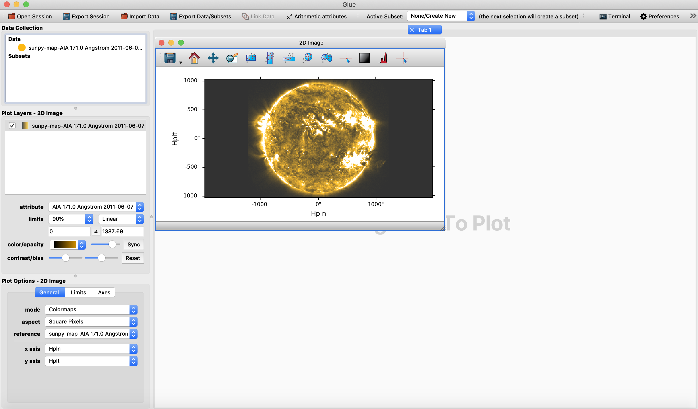
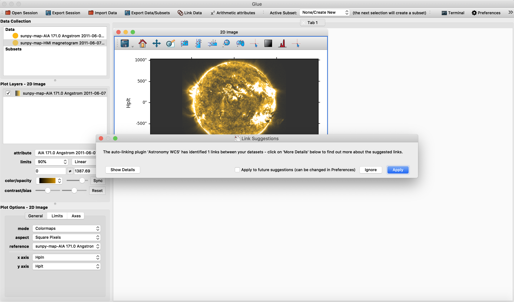
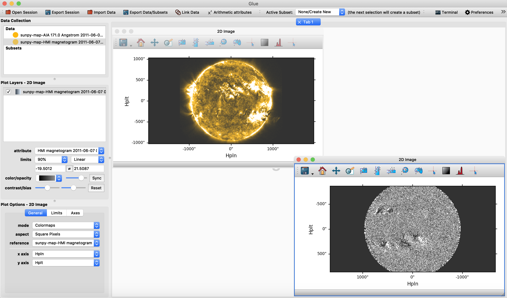
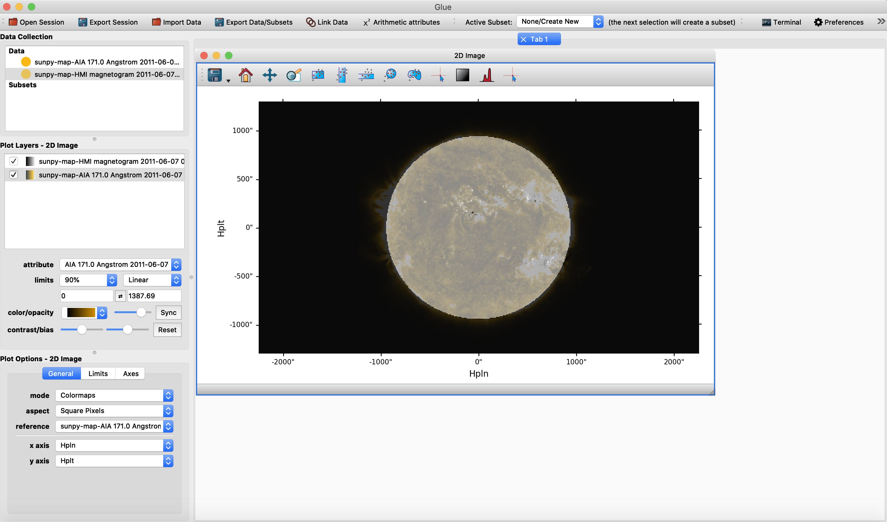

.. _loading_aia_and_hmi_files:

=========================================================
Loading and over-plotting AIA and HMI files as sunpy Maps
=========================================================

Loading the files
-----------------

Upon firing up ``glue`` while the environment is with ``glue-solar`` installed, import data with the third icon from the left on the top navigation bar of ``glue``.
Choose the file one would like to view, then before clicking the "Open" button, select from the dropdown menu at the bottom, the "sunpy Map" format.
Otherwise the AIA file would be loaded automatically as an ordinary FITS file instead.

Do this for the HMI file as well.

Overplotting AIA and HMI
------------------------

Once both the AIA and corresponding HMI data have been loaded, first drag and drop the AIA dataset from the upper left "Data Collection" panel to the viewing area with the "2D Image" data viewer chosen to display the AIA image.
The result would be a view like the following:

Autolinking is automatically detected.
If this the first time, you would be prompted with a dialog box to autolink as below:

Now do the same for the HMI dataset to a space outside of the AIA map now, you would see:

On the other hand, if you drag and drop the HMI data set on top of the AIA image we expect to see the following:

The final result will be an overplot of both the AIA and HMI, where the HMI image has been rotated and aligned with the AIA image.
