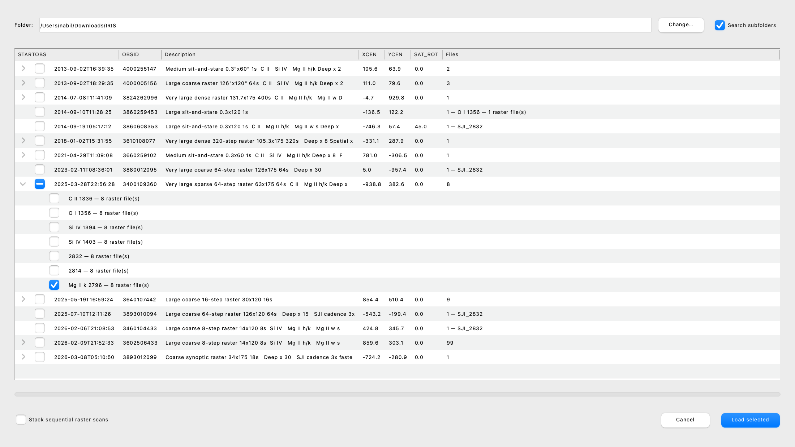

.. _glue_solar_users_guide_loading_iris_level_2_raster_and_sji_files:

======================================
Browsing and Loading IRIS Level 2 Data
======================================

Browsing a folder by observation
--------------------------------

``glue-solar`` adds an observation browser inspired by a subset of the IDL ``iris_xfiles`` tool;
it does not reproduce the IDL quicklook features.
Point it at any folder holding IRIS Level 2 files - the usual ``level2/yyyy/mm/dd/<obs>/`` tree,
a flat download folder, or a pooch cache - and it lists every observation it finds, grouped by
OBSID and start time, with the description, pointing and number of files:

Open it from the "Plugins" menu with "IRIS: browse observations...". Subfolders are searched by
default; un-tick "Search subfolders" to look at one folder only. The last folder used is remembered.

Expand an observation to see what can be loaded:

- one entry per slit-jaw band (``SJI_1330``, ``SJI_1400``, ``SJI_2796``, ``SJI_2832``),
- one entry per raster spectral window (for example ``Mg II k 2796 - 8 raster file(s)``): every
  raster scan of the observation is loaded for that window,
- one entry per co-aligned SDO/AIA cutout when an ``_SDO`` folder is present.

Tick the entries you want (ticking the observation row ticks everything under it) and press
"Load selected". The data are added to the data collection and the first slit-jaw (or AIA) cube is
opened in an Image Viewer; use its slider to step through time.
Tick "Stack sequential raster scans" to place two or more raster scans of a window into a single
4D cube without resampling their detector values. Its leading ``Scan`` coordinate selects the
original raster scan, and its ``Time`` component contains the exact acquisition time of every
pixel. Scan 0 supplies the stack's nominal helioprojective WCS; later scans remain aligned by
raster and detector index rather than carrying their distinct absolute pointings. Load scans
separately when those per-scan absolute coordinates are required. A selected window containing one
scan loads normally as a 3D dataset and also exposes its exact per-step ``Time`` values.

Downloads that are still packed (``*_raster.tar.gz``, ``*_SDO.tar.gz``) show up under their observation
as an "Extract ..." entry. Tick it and press "Load selected": the archive is unpacked into a folder of
the same name next to it (the layout irispy and pooch use), the list refreshes, and you can then tick
the spectral windows or cutouts it contained. Extraction is completed in a temporary sibling
directory, so a failure leaves the archive visible for retry. Nothing is loaded in that step, and
the archive is left in place.

Opening a single file
---------------------

"File -> Open Data Set" also understands IRIS Level 2 files directly: a slit-jaw file loads as one
cube, and a raster file loads one dataset per spectral window.

Linking
-------

Glue does not currently autolink irispy's time-varying SJI gWCS and raster ``-TAB`` WCS. To
propagate spatial selections, open the Data Manager's link editor and manually pair
``Helioprojective Longitude`` and ``Helioprojective Latitude`` between datasets.

Saving sessions
---------------

Glue sessions containing these IRIS datasets cannot currently be restored reliably. The irispy
metadata and WCS objects, including SJI gWCS and raster lookup tables, need dedicated serializers;
save derived products separately rather than relying on a Glue session as their only copy.
