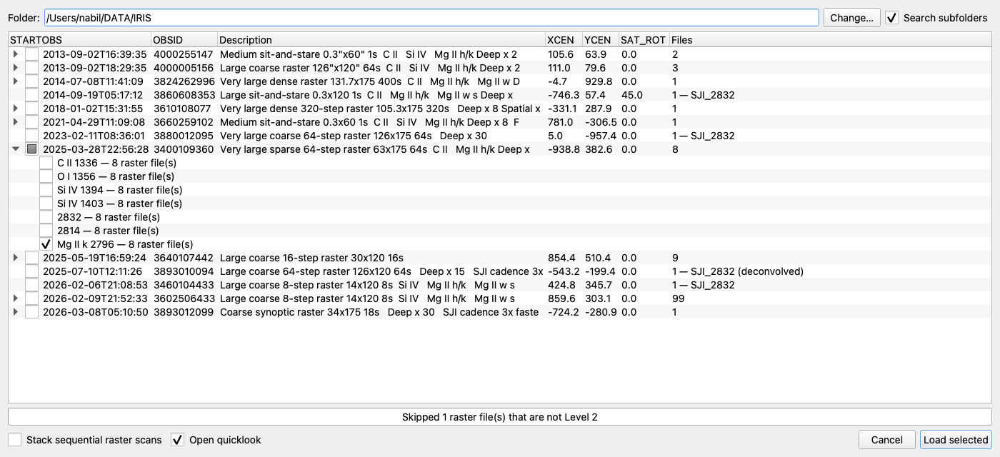

.. _glue_solar_users_guide_loading_iris_level_2_raster_and_sji_files:

======================================
Browsing and Loading IRIS Level 2 Data
======================================

Browsing a folder by observation
--------------------------------

``glue-solar`` adds an observation browser inspired by a subset of the IDL ``iris_xfiles`` tool;
it does not reproduce the IDL quicklook features.
Point it at any folder holding IRIS Level 2 files - the usual ``level2/yyyy/mm/dd/<obs>/`` tree,
a flat download folder, or a pooch cache - and it lists every observation it finds, one row per
OBSID and start time, with the columns STARTOBS, OBSID, Description, the pointing XCEN, YCEN and
SAT_ROT, and Files, the number of files:

Open it from the "Plugins" menu with "IRIS: browse observations…". Subfolders are searched by
default; un-tick "Search subfolders" to look at one folder only. The last folder used is remembered.
A raster file that is not Level 2 (its ``DATA_LEV`` is not 2), such as a product derived from
rasters, is left out, and the progress bar says how many were, for example "Skipped 1 raster file(s)
that are not Level 2".

Expand an observation to see what can be loaded:

- one entry per slit-jaw band (``SJI_1330``, ``SJI_1400``, ``SJI_2796``, ``SJI_2832``), and a
  separate one for each deconvolved slit-jaw file (``SJI_2796 (deconvolved)``),
- one entry per raster spectral window (for example ``Mg II k 2796 — 8 raster file(s)``): every
  raster scan of the observation is loaded for that window,
- one entry per co-aligned SDO/AIA cutout (``aia_l2_*.fits``), for example ``AIA 1700``. Cutouts
  are recognised by file name and header, so they need no ``_SDO`` directory.

An observation with only one entry shows it in its "Files" column (for example ``1 — AIA 1700``)
and has its tick box on its own row.

Tick the entries you want (ticking the observation row ticks everything under it); each slit-jaw
channel and AIA cutout you tick loads as a dataset of its own. Then press "Load selected": the data
are added to the data collection. glue reads the files in the background, one at a time, and the
progress bar counts them; meanwhile the list and its boxes are locked and "Cancel" reads "Stop".
"Stop" ends the load once the file being read is done and loads the entries read in full, such as a
slit-jaw channel read before a raster window, or nothing if none was. Pressing Esc or closing the
browser drops the load: nothing is loaded. With "Open quicklook" ticked, the default, each
observation with a raster or slit-jaw image opens in a quicklook (see `The quicklook`_). Otherwise the
first slit-jaw (or AIA) cube opens in an Image Viewer, where its ``Time (Utc)`` slider steps through
time; nothing opens for rasters alone. If an entry fails to load, the browser stays open and its progress bar names
the file and the error; for a raster window, the first raster file that fails to load on its own, or
how many raster files there are if each loads on its own but not together.
Tick "Stack sequential raster scans" to place two or more raster scans of a window into a single
4D cube without resampling their detector values. Each scan stays in its own file, as a single scan
does (see `Memory and open files`_); scans stored as floating point, such as irispy's test files,
are copied into a temporary file (a NumPy memmap) instead. Its leading ``Scan`` coordinate
selects the original raster scan, and its ``Time`` component contains the exact acquisition time of
every pixel. Scan 0 supplies the stack's nominal helioprojective WCS; later scans remain aligned by
raster and detector index rather than carrying their distinct absolute pointings. Load scans
separately when those per-scan absolute coordinates are required. A selected window containing one
scan loads normally as a 3D dataset and also exposes its exact per-step ``Time`` values.

Every raster, stack, slit-jaw and AIA dataset has these components: the data (named after the
dataset), ``Time`` and ``Exposure time`` (a stack lists ``Exposure time`` before ``Time``),
``<label> mask``, which Glue computes from the data as it reads them and so lists under "Derived
components" (files stored as floating point keep it in memory, listed second), and ``<label> DN/s``,
also derived. ``Time`` is the UTC acquisition time as a datetime64, one value per raster step,
slit-jaw frame or AIA frame (per scan and step for stacks). ``Exposure time`` is in seconds, one
value per raster step or frame (per scan and step for stacks). ``<label> DN/s`` is the data divided
by the exposure time, with the unit DN/s (the 1D Profile viewer's "y_unit" menu labels its axis
with it), and NaN where an exposure took 0 s, as step 157 of OBSID 3610108077's Si IV windows did.
The "Frame time" tool in the Image Viewer toolbar shows the displayed frame's time and exposure in
the status bar, as a range when the image spans several frames; for a single slit-jaw frame its
tooltip gives that
frame's pointing (PZT offset, field-of-view centre and slit position), which glue-solar keeps in
the dataset's metadata. The mouse-over readout (see "Cursor readout" in `Viewer tools and windows`_)
gives the time and exposure of the pixel under the mouse: on a raster map those of the step it is
on.

Slit-jaw, raster and AIA values are floating point. The IRIS fill values -200 and -199 become NaN;
in AIA cutouts only -200 does. glue-solar leaves
+Inf samples (the ITN 26 saturation code) unchanged and outside the mask; Level 2 files stored as
16-bit integers cannot hold +Inf, so their saturated samples keep the largest value the file can
store. ``<label> mask`` is a uint8 array that is 1 where the data are NaN and 0 elsewhere.

Slit-jaw images open in sunpy's IRIS colormap of their channel, raster windows and stacks in its
FUV or NUV colormap by their detector (``TDETn``), and AIA cutouts in sunpy's AIA colormap of their
wavelength. The FUV and NUV colormaps have the colours of the 1330 and 2796 ones, whose names the
colormap menu of an Image Viewer layer shows for them. That menu lists Glue's own colormaps and
these IRIS and AIA ones, plus the colormap of any file loaded as a sunpy Map; Glue draws every
colormap listed each time it opens a layer, so the other sunpy colormaps are left out. To list
another, add it with ``colormaps.add`` in a ``config.py``, as
`Glue's customization guide <https://docs.glueviz.org/en/stable/customizing_guide/customization.html>`__
describes.

Rasters with a negative raster step (``STEPS_AV`` below -0.01) keep irispy's default orientation:
irispy reverses their raster-step axis, with the data, coordinates, times and per-step metadata
together, so the step axis runs opposite to the acquisition order and ``Time`` runs backwards
along it. The documented alternative is irispy's ``revert_v34=True`` option
(``irispy.io.spectrograph.read_spectrograph_lvl2``, also passed on by ``irispy.io.read_files``),
which keeps the file order; glue-solar does not use it.

Dragging a slice slider shows its latest position each time the image has been redrawn, skipping
the positions passed in between, and again when you let go, so large cubes keep up with the mouse;
the arrow keys, clicks on the slider and playback still step at once.

The point you select with the Pixel tool on a raster or stack is one slit position at one raster
step or exposure; on a stack it stays on the scan that was displayed when you clicked. If you then
swap the axes of a viewer of that dataset, for example turning the raster map into wavelength
against slit, the viewer's new step slider moves to the point. Wavelength sliders are never moved.
The "Coordinate" menu in the Image Viewer toolbar has "Time master", which records the displayed
dataset as the time reference of its observation (same OBSID and STARTOBS), and "Clear point".
The Pixel tool stays active after either entry.

Downloads that are still packed (``*_raster.tar.gz``, ``*_SDO.tar.gz``) show up under their observation
as an "Extract <archive> (<size> MB, next to the archive)" entry. Tick it and press "Load selected":
the archive is unpacked into a folder of the same name next to it (the layout irispy and pooch use),
the list refreshes, and you can then tick the spectral windows or cutouts it contained. Archives are
unpacked in the background too: "Stop" leaves those not yet started packed. Extraction
is completed in a hidden temporary sibling directory, which the list leaves out, so a failure leaves the
archive visible for retry.
Nothing is loaded in that step, and the archive is left in place.

Memory and open files
---------------------

Level 2 files store their data as 16-bit integers with a scale and an offset. glue-solar leaves
those integers in the file and scales only what a viewer, readout or profile reads, with the fill
values as NaN, so even every spectral window of a large observation opens in little memory; a
``.fits.gz`` file is decompressed into memory, at two bytes a sample. A slit-jaw or AIA file is
still read in full as it opens, briefly taking about one and a half times its size. The first image
of a window takes its colour limits from a count of every stored value (of evenly spaced raster
steps or frames of a window over 512 MiB), which takes up to about half a second, and the "99.5%"
and other presets of the layer's style editor use the same count; "Per-frame limits" (see `Viewer
tools and windows`_) count every value of the displayed slice. ``<label> DN/s`` and other derived
attributes take theirs from 10,000 random samples, as glue does for data in memory, so they are
approximate. Memory still grows as you view a window, since the parts of the file read are kept, and
a Profile or Histogram of a whole cube, a
value-range subset, "Slice Extraction" and an export each read every value, as they did before.
Datasets merged with glue's "Merge datasets" take glue's own colour limits, sampled from a few
corners of the data, so set those by hand.

Each loaded file stays open, once for each time windows are loaded from it (the observation browser
loads the windows ticked in an observation at once), so glue-solar raises the number of files glue
may have open to 10240, or the system's hard limit if lower. A file must not be overwritten, cut
short or have its drive disconnected while it is loaded, which can crash glue; the observation
browser's archive extraction never overwrites a file.

Opening a single file
---------------------

"File -> Open Data Set" also understands IRIS Level 2 files directly: a slit-jaw file loads as one
cube, and a raster file loads one dataset per spectral window, labelled with the file's raster number
(``…-r00003``). Files opened this way, or given on the ``glue`` command line, load one by one with
every spectral window and cannot be stacked, so use the observation browser for large or multi-scan
observations.

Overlaying the missing-data mask
--------------------------------

To see where data are missing, turn ``<label> mask`` into a
`subset <http://docs.glueviz.org/en/stable/getting_started/index.html#defining-subsets>`__, which
every Image Viewer of the dataset draws over the data. A selection replaces the subset selected in
the data collection, which in a quicklook is ``Point``, so select the dataset itself first:

- Select the dataset in the data collection and choose "Create faceted subsets" in the
  "Data Manager" menu (or the data collection's right-click menu). Pick the ``<label> mask``
  attribute, set the range from 0 to 1 and the number of subsets to 2. The second subset,
  ``0.5<=<label> mask<=1.0``, holds every missing sample, and the first the others.
- Or select the dataset in the data collection, show ``<label> mask`` in a Histogram viewer and
  select an "X range" over the bar at 1. The Histogram viewer asks "Add large data set?" for
  datasets of 2e7 samples or more, with Cancel as the default button: a full slit-jaw cube, such as
  the 6.5e7 samples of OBSID 4000255147's SJI 1400, needs "OK".
- A mask of your own comes from a FITS file through "Import subset mask(s)" in the "Data Manager"
  menu, with the dataset selected. Each HDU of signed integers (BITPIX 16, 32 or 64) becomes a
  subset of the samples above 0, and must have the dataset's shape. glue skips unsigned HDUs, such
  as 8-bit images (BITPIX 8) and 16-bit ones stored with BZERO. "Export subset mask(s)" writes
  masks it can read back.

The first two leave the new subset selected, and "Pixel" would replace it, so select ``Point`` in
the data collection before moving a quicklook's point again.

Linking
-------

The observation browser links the ``Helioprojective Longitude`` and ``Helioprojective Latitude``
of every slit-jaw image, raster and aligned AIA cutout it loads, so selections carry over between
them. It links any file loaded as a sunpy Map (see
:ref:`glue_solar_users_guide_loading_aia_and_hmi_files`) to them too, its degrees converted to
arcsec, while Glue's own WCS autolinking links maps to each other. For data opened with "File ->
Open Data Set", choose "IRIS: link helioprojective coordinates" from the "Plugins" menu; it only
adds links that are missing, so running it again after loading more data is safe. Removing a
dataset leaves the others linked. The links pair coordinates as they are: they do not allow for
the Sun's rotation between a map and the IRIS data, or for a map taken far from Earth. Once IRIS
data are linked, a selection on longitude or latitude values between two maps passes through them
too, so it ignores those differences between the maps; a region drawn on one map still reaches the
other through Glue's own link.

- A region drawn on a raster map or a sunpy Map selects, in every slit-jaw frame, the pixels that
  lie inside it at that frame's own pointing. For a sit-and-stare raster the selection marks where
  the slit was on the Sun during the selected exposures: it lies on the slit in the slit-jaw frames
  taken then, and moves away from it in other frames as the pointing changes.
- A region drawn on a raster map selects the pixels of a sunpy Map inside it, and the other way
  round.
- A selection on longitude or latitude, for example from a scatter plot, carries over in both
  directions. With a sunpy Map, one on longitude carries over only where Glue shows the map's
  longitude between -180° and 180°. Glue shows a map's longitudes as astropy gives them: from 0 to
  360° when the map's reference longitude is 0 or more, so that east of longitude 0 they are near
  360°, otherwise from -360° to 0.
- A region drawn on a slit-jaw image does not carry over to a raster or a sunpy Map: which frame it
  belongs to would need the time, and time is never linked.

A region drawn on a raster map can be slow to show on a slit-jaw image: glue works out the selection
for every screen pixel of the slit-jaw viewer each time it draws a frame, and does not respond
meanwhile. At the default viewer size this takes under a second with a 64-step raster, but 10 to 20
seconds with a 1600-step sit-and-stare raster, for every frame you step to, and longer in a larger
viewer. On a sunpy Map it takes about 4 seconds with a 1600-step raster, each time the map's viewer
draws.

The quicklook
-------------

The quicklook is a CRISPEX-style set of viewers for one observation, in a new tab. Open it

- from the observation browser, with "Open quicklook" ticked (the default): each observation you
  load opens in its own quicklook, showing the raster window you ticked if you ticked one;
- for data already loaded, with "IRIS: quicklook…" in the "Plugins" menu, which asks which
  observation when several are loaded;
- from the command line, with ``glue --startup=iris_quicklook`` followed by the files. Files given
  this way load one by one, so each raster file keeps its raster number in its label
  (``…-r00003``) and the quicklook shows the first; to stack the scans, use the browser;
- from glue's Terminal, with ``glue_solar.quicklook.quicklook(application, datasets)``.

For those used to CRISPEX:

.. list-table::
   :header-rows: 1

   * - CRISPEX or iris_xcontrol
     - In glue-solar
   * - ``crispex, raster, sjicube=sji`` (one call per observation)
     - Tick the observation in the browser, or ``glue --startup=iris_quicklook raster.fits sji.fits``
   * - several ``sjicube`` files
     - Tick every slit-jaw channel; each gets its own viewer
   * - iris_xcontrol's raster, sit-and-stare and multi-raster modes
     - Chosen from the observation: map, slit against time, or a stack's map with its scan slider
   * - ``spcube`` (transposed cube)
     - Not needed: the wavelength panel shows wavelength against step, exposure or scan
   * - ``dt`` and non-equidistant timing
     - "Regrid on time" (see `Regridding on time`_)

It shows one spectral window: Mg II k 2796 when loaded, otherwise the first (pass
``window="Si IV 1403"`` to choose). The raster opens as three panels, plus one viewer per slit-jaw
channel and a spectrum panel:

- a raster: the map (step against slit), the spectrogram (wavelength against slit) and wavelength
  against step;
- a sit-and-stare raster: slit against time, the spectrogram and wavelength against time;
- a stack of raster scans: the map of the current scan, the spectrogram and wavelength against scan.

A sit-and-stare raster's exposure axis, in the quicklook or any Image viewer, is labelled
"Exposure (acquisition order)" with the UTC range of its exposures on a second line, and its ticks
are exposure numbers: it is an index axis, so exposures are evenly spaced whatever their cadence
(`Regridding on time`_ places them in time). The other axis shows only its own coordinate, and so
does the mouse-over readout, followed by the time and exposure of the exposure under the mouse,
rather than where the slit was then. The label and ticks come back whenever glue resets
the axes, after an axis change or, on the wavelength panel, a slit move; a label typed in the
viewer's axes options is kept until that reset, as glue's own labels are.

In every Image viewer, each world coordinate's ticks are labelled with that coordinate's name.
WCSAxes can put a coordinate's ticks on another side than the axis it belongs to: latitude can run
along the bottom of a slit-jaw image rolled by more than 45°. The label then stays with the ticks,
and an x or y axis label typed in the axes options names the coordinate of that axis, wherever its
ticks are; glue-core 1.27.0 alone labels the bottom and left ticks after the x and y axes, whichever
coordinate they show.

On an image that shows another coordinate, such as wavelength or time, beside longitude and
latitude, an angle that changes by less than 5 % of the other across the image has no tick labels,
also after glue resets the axes: the latitude along a raster's steps on the wavelength-against-step
panel, or the longitude along the slit on the spectrogram. WCSAxes would label it wherever pointing
jitter takes it across a tick value, one label over another or off the panel. An image of the two
angles alone, such as the map, a slit-jaw image or any other celestial map, keeps both.

The map shows the wavelength nearest the window's reference wavelength, and the panels use
99.5 % limits. A point, the edit subset "Point", starts at the centre of the map with the Pixel
tool active: drag it on the map, and the spectrum panel shows its spectrum. The point is a detector
pixel (a step or exposure, and a slit position) at every wavelength, and the other panels follow
it: the spectrogram moves to its step and the wavelength panel to its slit. Its crosshair shows
only on the map; the spectrogram and the wavelength panel highlight its row instead. Clicking the
spectrogram or the wavelength panel moves the point there and the map to the clicked wavelength;
no other wavelength slider moves. Moving a step, exposure or scan slider moves the point, so on a
stack the point stays on the map's scan. A Profile's collapse of an axis is left in place. After
"Clear point" the panels stop following each other until the next click, except in time: the
slit-jaw viewers keep following the exposure slider of a sit-and-stare raster and the scan slider of
a stack's map, on a scanning raster the time stays at the last point's raster step, and a slit-jaw
time master (see below) still moves the others. A point clicked on a slit-jaw image is
marked only there, and the spectrum panel is empty until the next raster click. The raster panels have no region selection tools, because a region drawn on a
raster map is recomputed on every slit-jaw viewer for each screen pixel at every frame (see
Linking). Each quicklook has its own point, shown only in its own panels, edited while its tab is
shown and moved only by that tab's sliders. Where a point does not show, it is not in the viewer's
layer list either, since glue would still redraw a hidden layer at every move: drag the subset onto
a viewer outside its quicklook to show it there. In its own quicklook, each move adds the point
back to the image panels of the dataset it is on and removes it from the others. Another Image viewer of the same data follows the point. When a slit-jaw channel is loaded both plain and deconvolved,
the plain one is shown and the status bar names the other. The spectrum panel does not ask "Add
large data set?", and the status bar gives the size of the data it shows.

The panels also follow one time. The raster is the time master: the slit-jaw viewers show the frame
nearest the time of the point's exposure or raster step (mid-raster before there is a point). Choose
"Time master" in the "Coordinate" menu of a slit-jaw viewer to make it the master instead; the
raster then moves to the exposure, or on a stack the scan, nearest each frame, keeping the slit and
the raster step. The master rules: while there is a point, moving the raster's exposure or scan
slider by hand, or clicking another exposure or scan, snaps the raster back to the one matching
the master's frame (after "Clear point" it keeps a hand-moved exposure or scan, as below), while a
slit-jaw follower moved by hand keeps its frame until the panels next follow the time, on a click, a
move of the point or of the master, or when its tab is shown again. A dataset with nothing within
half its own time step of the master's time (for a
scanning raster, one that does not cover it) keeps its frame and is greyed. The "Frame time" readout
says which dataset is the time master, how far each matched dataset's time is from the master's
(Δt) and "NO MATCH" with that offset for the others. Wavelength and slit sliders are never moved.

Each slit-jaw viewer is titled with its channel ("SJI 1400", "SJI 2796 (deconvolved)") and opens on
the raster's field of view with a margin. Every slit-jaw viewer, in a quicklook or not, draws the
displayed frame's slit as a dashed line (from the frame's slit position in the file) and the raster
point as a red cross, placed with that frame's own pointing. The cross is hidden, and the "Frame
time" readout says "outside SJI FOV", when the point is off the image; neither is drawn while the
viewer shows the frame axis. A slit-jaw frame taken a raster step earlier or later than the point
shows the slit a step away from the cross.

Regridding on time
------------------

Every axis of glue's viewers is an index axis, so a sit-and-stare raster's exposures, a slit-jaw
image's frames and a stack's scans show evenly spaced whatever their timing: the cadence of OBSID
4000255147's Si IV varies from 2.71 to 3.29 s, and an observation can have gaps. To see them in
time, select one such dataset in the data collection and choose "Regrid on time" from its
right-click menu. This adds ``<label> regridded``, resampled at the median step between their times:
each pixel along that axis is one step after the previous one, from the first time up to the first
pixel at or past the last, and holds the exposure, frame or scan nearest its time within 0.75 steps
(the earlier of two as near), so one exposure can fill two pixels. A pixel with none, in a gap, is
NaN, with ``Time`` NaT, ``Exposure time`` NaN and the missing-data mask 1. The 1600 exposures of
4000255147's Si IV, 4750 s at a median step of 2.89 s, give 1645 pixels, none of them empty.

- A stack is regridded scan by scan, each scan timed by its middle raster step: its steps are
  places on the Sun, so each pixel keeps a whole scan, and the scan slider stays its time, as in
  the quicklook.
- A scanning raster is refused with a message saying why: its steps are places on the Sun, not
  times. Stack its scans in the observation browser and regrid the stack instead.
- The new dataset has the original's other axes, units, colormap, ``<label> DN/s`` and metadata,
  ``meta['time_step']`` adding the step in seconds, and its coordinates: along the regridded axis,
  those at each pixel's time, so that a slit-jaw image's time coordinate is regular, and those of
  the last time for a last pixel past it. Its helioprojective coordinates are linked with the other
  IRIS datasets, no viewer opens, and data read from their files as they are viewed (see `Memory and
  open files`_) stay there.
- In an Image viewer, a regridded sit-and-stare raster's time axis is labelled "Time (2.89 s per
  pixel)", with the UTC range of its exposures on a second line, and its ticks are pixel numbers. It
  follows and leads the time sync as its original does (see `The quicklook`_): a pixel in a gap has
  no time, so its "Frame time" readout is empty, the other datasets keep their frames and show "NO
  MATCH", and a slit-jaw time master never moves it into a gap. "IRIS: quicklook…" shows the
  original; for a quicklook of the regridded raster, type
  ``quicklook(application, [regridded, sji])`` in glue's terminal, after
  ``from glue_solar.quicklook import quicklook``. ``glue_solar.regrid.regrid_on_time(data)`` regrids
  a dataset there too.

Viewer tools and windows
------------------------

glue's `getting started guide <http://docs.glueviz.org/en/stable/getting_started/index.html>`__
describes its viewers and tools; this section names those IRIS work uses most, as glue-qt 0.4.2
labels them. A toolbar button's tooltip gives the tool's single-key shortcut if it has one, for
example "Zoom to rectangle [shortcut: Z]".

Besides glue's "Home" (H), "Pan" (M), "Zoom" (Z) and region selection tools, the Image Viewer
toolbar has:

- "Pixel" ("Select a single pixel based on mouse location"): click or drag to select one pixel.
  On IRIS data this is the point the other viewers follow (see `The quicklook`_).
- "Contrast/Bias": drag on the image, left and right for the bias, up and down for the contrast.
  The "Reset" button next to the layer's contrast/bias sliders undoes it.
- "Slice Extraction" (P): draw a path and press Enter to see the data along it in a new window.
  It is offered for 3D data only, so not for stacks.
- "Cursor readout", from glue-solar: the world position under the mouse, the ``Time`` (UTC, to the
  millisecond) and ``Exposure time`` of that pixel, and its value, in the status bar, for example
  ``65.13" 109.32" (world) · 2013-09-02T18:31:07.229 UTC · exp 2 s | value = -3`` on a raster map,
  where the time is that of the step under the mouse; on a slit-jaw image or a sit-and-stare
  raster it is that of the frame or exposure. Helioprojective angles are in arcsec to 0.01″ and
  IRIS wavelengths in Å to 0.001 Å, a tenth of an IRIS pixel or finer, whatever the zoom; other
  coordinates, such as a stack's scan or a Carrington longitude, are as on their ticks. Press W
  over the image to switch between world and pixel positions; the button hides and shows the
  readout, and the mouse mode, such as Pixel, stays on.
- "Frame time" and the "Coordinate" menu, from glue-solar, described above; the "Frame time" button
  hides and shows its readout of the displayed frame, not the mouse-over one, and the mouse mode
  stays on.
- "Hide axes", from glue-solar: hides the viewer's axes (ticks, tick labels, axis labels and frame),
  and shows them again; the mouse mode, such as Pixel, stays on. Without them each slice step and
  redraw is faster, since no ticks are placed; the image, subsets, links, the slit and point of
  slit-jaw viewers and the readouts work as before, and the mouse-over position stays in world
  coordinates. A saved session keeps each viewer's choice. To open every new Image viewer,
  quicklook panels included, without axes, add ``solar_show_axes = false`` to the ``[main]`` section
  of glue's settings file, ``~/.glue/settings.cfg``, or type
  ``from glue.config import settings; settings.SOLAR_SHOW_AXES = False`` in glue's terminal for the
  rest of the session ("OK" in glue's Preferences then saves it to that file).
- "Per-frame limits", from glue-solar: takes the colour limits of the displayed dataset from the
  displayed slice, at the layer's percentile (99.5 % on the quicklook panels), so each slice step,
  such as a wavelength step of a raster map, gets that slice's limits; press it again for the whole
  cube's limits. Layers of other datasets keep theirs, and choosing another reference data in the
  viewer's options gives the previous one the whole cube's limits again. The mouse mode, such as
  Pixel, stays on. The button does not stay pressed: the limits in the layer's style editor change
  with each step while it is on. A session saved with it on does not open (see `Saving sessions`_).
- "Physical aspect", from glue-solar: shows the image in its proportions on the sky, an arcsecond
  as long on screen along x as along y, and pressed again, with the aspect it had; the mouse mode
  stays on. It sets the aspect in the viewer's options to "Square Pixels", scaled by the ratio of
  the arcseconds a pixel spans along y and along x, on average across the image through the centre
  of the view, so that a raster map of 2″ steps along a slit of 0.17″ pixels shows each step 12
  times as wide as a slit pixel is tall, wherever the view is. Resizing, zooming, panning and the
  sliders keep the proportions, and choosing other x or y axes shows the new image whole, in its
  own proportions. Axes other than a longitude and a latitude alone show square pixels: a
  spectrogram, a sit-and-stare raster's exposures against its slit, or a slit-jaw image's x
  against time. Choosing "Automatic" in the viewer's options switches it off too. Pressed again on
  a quicklook raster panel, whose aspect is "Automatic", the image fills the panel again, keeping a
  zoom. A saved session restores the viewer with "Square Pixels".
- A button with a spectrum icon and no tooltip, which opens a 1D Profile viewer of the image's data.
- The save menu, with "Save plot to file" and "Save Python script to reproduce plot", and the
  window menu, with "Move to another tab" and "Change viewer title".

Each viewer is a window in the current tab, with its own minimise, maximise and close buttons. The
"Canvas" menu has "New Data Viewer" (Ctrl+N), "New Tab" (Ctrl+T), "Gather Windows" (Ctrl+G), which
places the tab's viewers side by side, and "Rename Tab" (Ctrl+R); on macOS these use Cmd. Backspace
closes the active viewer after asking "Do you want to close this window?" if it is one of glue's own
Image, Scatter or Histogram viewers. It does nothing in a Profile or Table viewer, or in the
quicklook's map, spectrogram and wavelength panels. In the data collection, though, Backspace is
"Delete Layer": it removes the selected datasets and subsets at once, without asking and without
undo.

The stretch menu in the Image Viewer's layer options lists glue-solar's "Gamma 0.4", "Gamma 0.75",
"Gamma 1.5" and "Gamma 2.2" after Glue's own stretches. Each raises the values between the limits to
that power: a gamma below 1 brightens faint emission, one above 1 darkens it, and "Square Root" is a
gamma of 0.5.

Saving sessions
---------------

Saving a session that contains IRIS data can fail before any file is written. The irispy
metadata and WCS objects, including SJI gWCS and raster lookup tables, need dedicated serializers,
and data read from their files as they are viewed cannot be saved in a session yet; save derived
products separately rather than relying on a Glue session as their only copy. With glue-core 1.27.0
a session saved while an Image viewer has "Per-frame limits" on, whatever its data, does not open:
glue reports "'NoneType' object has no attribute 'add_callback'". Turn them off before saving.
